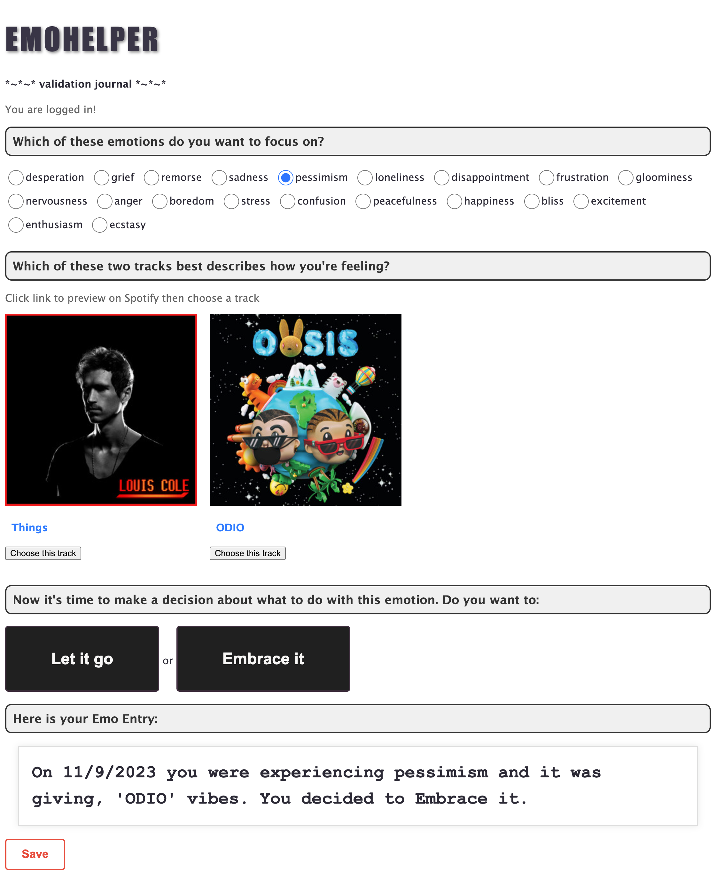

# EmoHelper

App Overview: EmoHelper is a validation journal designed to enhance emotional awareness. It guides users through the process of identifying their emotions. Leveraging the Spotify Web API, the app intelligently suggests tracks from the user's personal Spotify library that align with the emotional tone, using the valence data of each track. As a final touch, EmoHelper generates personalized "emo entries" — validating statements in line with the app's theme — and securely stores them in a database.

Pitch: Embrace emotional awareness with EmoHelper. This unique app not only helps you recognize and name your emotions, but it also offers a cathartic experience by curating music that you can listen to. At the end, you're empowered to decide whether to 'let go' or 'embrace it', which is a crucial step for facilitating emotional processing.

# Techstack

Languages: Javascript, HTML, CSS
Frameworks: React.js, Express.js, Node.js, PostgreSQL
API: Spotify Web API, multiple endpoints (see SpotifyApi.js)
https://developer.spotify.com/documentation/web-api

See db.sql file for database schema and tables

# User Flow and Component Tree

# Considering Future Features and Limitations

1. In the future, I'd like to not only save the emo entries in the db, but also create a dashboard where users can look back at all their previous entries.
2. Currently, the user can is redirected to their spotify account to listen to the song and I'd like to add a feature where they can listen within the app and create emo_playlists from their dashboard entries as well
3. Use a language model or chat GPT to allow users to search with any emotion rather than the hard coded mapped out emotion options.
4. Consider the limitation that only non-spotify account holder can use this app and consider explanding it to multiple streaming services like apple music, etc.
5. Enhance the music curation by considering additional music features such as the tracks "danceability", "energy" and "loudness".
6. Address another limitation: emotions are entirely subjective and the app might not suggest songs that accurately represent the emotion being felt. One small solution, which doesnt address the whole problem, is allowing a reshuffle of the song.
